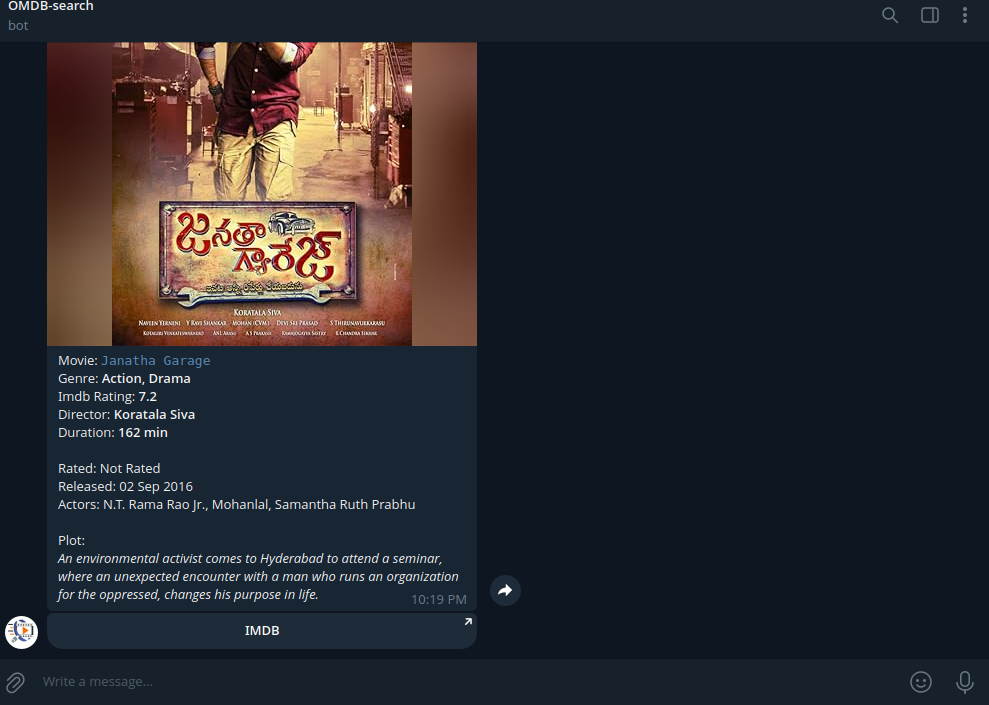
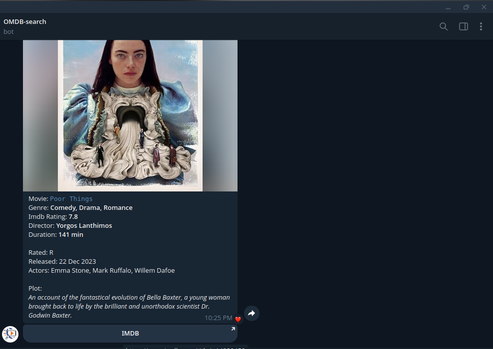
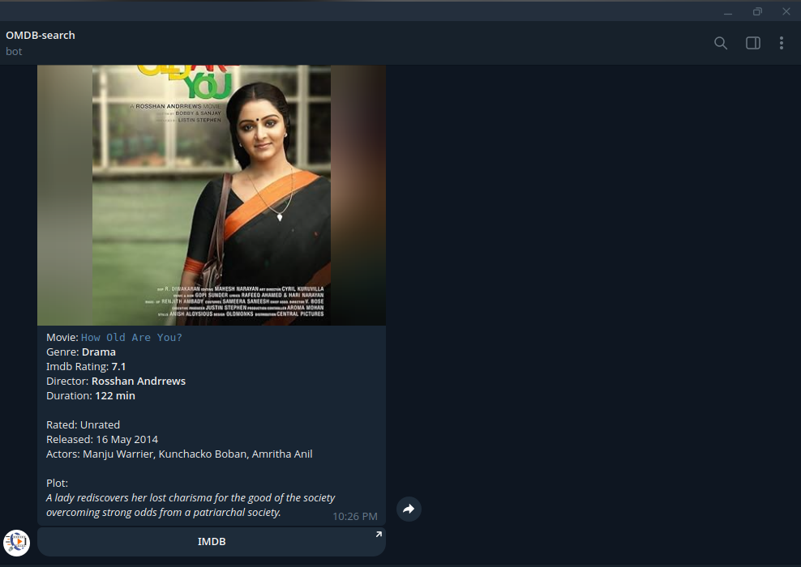

# Movie search Telegram bot 

This bot can find movie or series details. 
I created this bot using the api **OMDB** it was powerfull and give all the basic IMDB details 
I used python-telegram-bot api to build the telegram bot 
I created a simple package for **OMDB** api 

# Install the bot

<pre>
  <code>
    git clone https://github.com/Akhilesh286/search-movie.bot.git
    cd search-movies.bot
  </code>
</pre>

<pre>
  <code>
    echo """
    TOKEN= replace this with your token 
    API_KEY= replace this with your api key
    """ >> .env
  </code>
</pre>

<pre>
  <code>python3 main.py
  </code>
</pre>

# Screenshots

